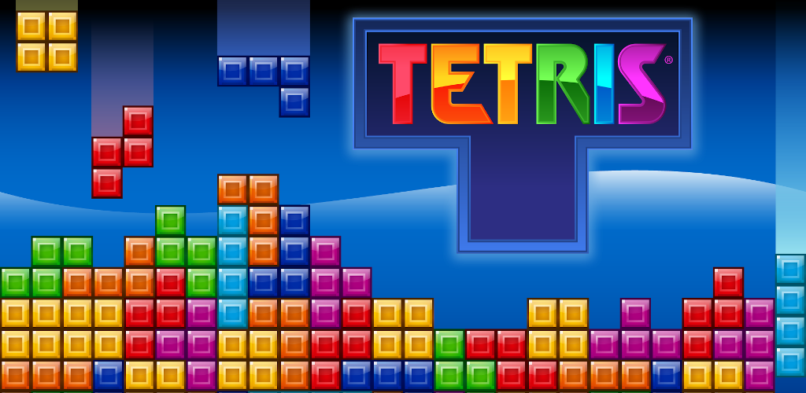

# Tetris Game Made With Jetpack Compose

Welcome to the Tetris Game! This app brings the classic block-stacking fun of Tetris to your Android device, built with Jetpack Compose for a smooth and engaging gameplay experience. Here’s some things to get started.

---

## Table of Contents

- [Tetris Game Made With Jetpack Compose](#tetris-game-made-with-jetpack-compose)
  - [Table of Contents](#table-of-contents)
    - [Overview](#overview)
    - [Getting Started](#getting-started)
    - [How to Play](#how-to-play)
      - [Controls:](#controls)
      - [Scoring:](#scoring)
    - [Features](#features)
    - [FAQ](#faq)

---

### Overview

This Tetris game recreates the classic gameplay with modern visuals and responsive controls, thanks to Jetpack Compose. Whether you're a seasoned Tetris player or new to the game, you’ll enjoy clearing lines, leveling up, and challenging yourself as the blocks fall faster and faster.

### Getting Started

1. **Download and Install**: Install the Tetris app on your Android device.
2. **Launch**: Open the app, and you’ll see the Tetris grid ready for action!

### How to Play

The goal is to arrange falling blocks (Tetriminos) to create complete horizontal lines. Completed lines clear, making room for more blocks, and earn you points. The game gets progressively faster, so keep up!

#### Controls:
- **Move Left**: Swipe left to slide the block to the left.
- **Move Right**: Swipe right to move the block to the right.
- **Rotate Block**: Double-tap on the screen to rotate the block.
- **Quick Drop**: Swipe down to make the block fall faster.

#### Scoring:
- Each cleared line awards points. Try to clear multiple lines at once for a higher score!

### Features

- **Classic Tetris Gameplay**: Play with traditional rules, where each falling block must be arranged to complete lines.
- **Dynamic Difficulty**: The game speeds up as you clear more lines, adding to the challenge.
- **High-Quality Graphics**: Crisp visuals rendered with Jetpack Compose’s `Canvas` feature.
- **Real-Time Scoring**: See your score increase as you clear lines, with the goal to keep improving with each game!

### FAQ

- **Can I pause the game?**  
  Currently, there is no pause feature, so finish a session if you need to step away.

- **Why does the game speed up?**  
  Each level cleared increases the speed, making the game more challenging as you progress.

- **How do I reset my score?**  
  Simply start a new game, and your score will reset to zero.

---

Ready to stack, clear, and climb the leaderboard? Get started with Tetris and enjoy testing your puzzle skills! Happy playing!
